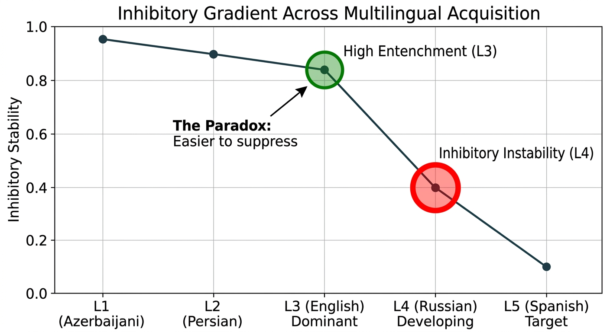

## Research Visualizations
‌
### 1. Inhibitory Gradient Across Multilingual Acquisition

‌
# The Paradox of Inhibitory Control in Higher-Order Multilingualism
‌
Author: Dr. Pegah Merrikhi
Field: Psycholinguistics
‌
---
‌
## Project Overview
This research investigates the 'Inhibitory Paradox' in multilingual speakers. The core hypothesis is that L4 Russian produces stronger interference than L3 English during L5 Spanish production.
‌
## Repository Structure
- preregistration/: Study design
- data/: Intrusion counts
- code/: Analysis scripts
- plots/: Figures
‌
## Installation & Setup
To install dependencies:
`pip install -r requirements.txt`
‌
## Running the Analysis
- To generate plots: `python code/generate_all_figures.py`
- To run statistical tests: `python code/statistical_analysis.py`
‌
---
‌
## Research Visualizations
### 1. Inhibitory Gradient
Inhibitory Gradient
‌
### 2. Statistical Findings
- Russian (L4) Intrusions: High frequency.
- English (L3) Intrusions: Low frequency.
- Significance: χ2(1) = 34.78, p < .001
‌
---
‌
## Citation
Merrikhi, P. (2026). The Paradox of Inhibitory Control in Higher-Order Multilingualism.
‌
---
‌
## Contact Information
If you have any questions regarding this research or would like to collaborate, feel free to reach out:
‌
- **Email:** Deniz.qizi@gmail.com
- Pegah.Merrrikhiii@gmail.com
‌
